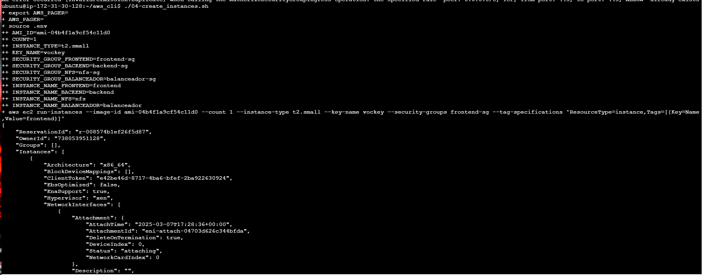
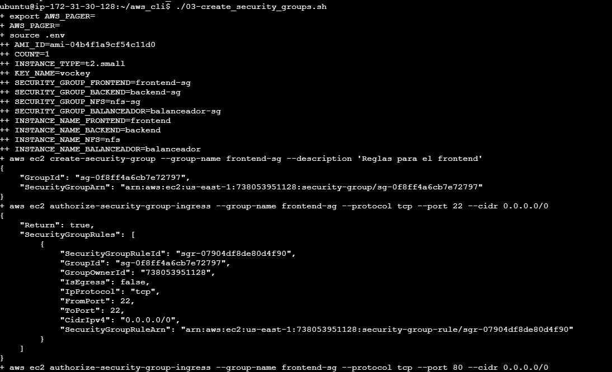

# AWS CLI EN TRES NIVELES
Si queremos utilizar las credenciales de  **AWS Academy**  solo tenemos que copiar en el archivo  `~/.aws/credentials`  los datos que nos aparecen en el apartado  **AWS Details**  ->  **Cloud Access**  ->  **AWS CLI**, dentro del  **Learner Lab**  de **AWS Academy**.

## 00-terminate_all_instances.sh
Este script utiliza **AWS CLI** para terminar instancias en ejecución:
- **`set -x`**: Activa el modo de depuración, lo que imprimirá cada comando y sus argumentos antes de ejecutarlos. Es útil para rastrear la ejecución del script.
- **`export AWS_PAGER=""`**: Establece la variable de entorno `AWS_PAGER` a una cadena vacía, desactivando la paginación de resultados de **AWS CLI.** 
- **`EC2_ID_LIST=$(...)`**:  Sirve para obtener una lista de **ID** de instancias que están en estado "running". La salida se almacena en la variable `EC2_ID_LIST`.
-    **`aws ec2 terminate-instances`**: Utiliza **AWS CLI** para enviar el comando de terminación de instancias.
-   **`--instance-ids $EC2_ID_LIST`**: Especifica los **ID** de las instancias  que se deben terminar, utilizando la lista obtenida anteriormente.

## 01-delete_all_security_groups.sh
Este script sirve para eliminar todos los grupos de seguridad existentes en la cuenta de **AWS**.
- **`set -x`**: Activa el modo de depuración, lo que imprimirá cada comando y sus argumentos antes de ejecutarlos. Es útil para rastrear la ejecución del script.
- **`export AWS_PAGER=""`**: Establece la variable de entorno `AWS_PAGER` a una cadena vacía, desactivando la paginación de resultados de **AWS CLI.** 
- **`SG_ID_LIST=$(...)`**: Sirve para obtener una lista de **IDs** de todos los grupos de seguridad en la cuenta **AWS**.
-   **`for ID in $SG_ID_LIST`**: Recorre la lista de **IDs** de grupos de seguridad.
-   **`echo "Eliminando $ID ..."`**: Imprime un mensaje indicando que se está eliminando el grupo de seguridad con la **ID** del recorrido actual.
-   **`aws ec2 delete-security-group --group-id $ID`**: Sirve para eliminar el grupo de seguridad con la **ID** del recorrido actual.

## 02-delete_all_elastic_ips.sh
Este script sirve para liberar todas las direcciones **IP elásticas** asociadas en la cuenta de **AWS**.
- **`set -x`**: Activa el modo de depuración, lo que imprimirá cada comando y sus argumentos antes de ejecutarlos. Es útil para rastrear la ejecución del script.
- **`export AWS_PAGER=""`**: Establece la variable de entorno `AWS_PAGER` a una cadena vacía, desactivando la paginación de resultados de **AWS CLI.** 
- **`ELASTIC_IP_IDS=$(...)`**: Sirve para obtener una lista de **IDs** de asignación de todas las direcciones **IP elásticas** en la cuenta.
-   **`for ID in $ELASTIC_IP_IDS`**: Recorre la lista de **IDs** de asignación de direcciones **IP elásticas**.   
-   **`echo "Eliminando $ID ..."`**: Imprime un mensaje indicando que se está liberando la dirección **IP elástica** con la **ID** del recorrido actual.
-   **`aws ec2 release-address --allocation-id $ID`**: Sirve para liberar la dirección **IP elástica** con la **ID** del recorrido actual.

## 03-create_security_groups.sh
Este script utiliza **AWS CLI** para crear grupos de seguridad y definir reglas de acceso para **Frontend**, **Backend**, **NFS** y **Balanceador**) especificados en el archivo `.env`
- **`set -x`**: Activa el modo de depuración, lo que imprimirá cada comando y sus argumentos antes de ejecutarlos. Es útil para rastrear la ejecución del script.
- **`export AWS_PAGER=""`**: Establece la variable de entorno `AWS_PAGER` a una cadena vacía, desactivando la paginación de resultados de **AWS CLI.** 
- **`source .env`**: Importa variables desde el archivo `.env`.

- **`aws ec2 create-security-group \ --group-name $SECURITY_GROUP_FRONTEND \ --description "Reglas para el frontend"`**: Crea un grupo de seguridad llamado `$SECURITY_GROUP_FRONTEND` con una descripción asociada. 
- **`aws ec2 authorize-security-group-ingress \ --group-name $SECURITY_GROUP_FRONTEND \ --protocol tcp \ --port 22 \ --cidr 0.0.0.0/0`**: Define reglas de acceso para el **grupo de seguridad**. `$SECURITY_GROUP_FRONTEND`. Permite el tráfico **TCP** en los puertos **22, 80 y 443** desde cualquier dirección **IP**.

Este mismo patrón se repite para los grupos de seguridad **Backend**, **NFS** y **Balanceador**.

## 04-create_instances.sh
Estas secciones del script utiliza **AWS CLI** para lanzar instancias en **AWS**, especificando diferentes grupos de seguridad y etiquetas para cada tipo de instancia **Frontend**, **Backend**, **NFS** y **Balanceador**.
- **`set -x`**: Activa el modo de depuración, lo que imprimirá cada comando y sus argumentos antes de ejecutarlos. Es útil para rastrear la ejecución del script.
- **`export AWS_PAGER=""`**: Establece la variable de entorno `AWS_PAGER` a una cadena vacía, desactivando la paginación de resultados de **AWS CLI.** 
- **`source .env`**: Importa variables desde el archivo `.env`.
- Lanza una **instancia** para el **Frontend 1** con los parámetros especificados, como la **AMI** (`$AMI_ID`), la **cantidad** de instancias (`$COUNT`), el **tipo** de instancia (`$INSTANCE_TYPE`), la **clave** (`$KEY_NAME`), el **grupo de seguridad** (`$SECURITY_GROUP_FRONTEND`) y asigna una etiqueta con **el nombre** (`$INSTANCE_NAME_FRONTEND`).

Este mismo patrón se repite para las instancias **Frontend 2**, **Backend**, **NFS** y **Balanceador**

## 05-create_elastic_ip.sh
Este script utiliza la **AWS CLI** para realizar las siguientes acciones:

1.  Obtiene la **ID** de la instancia con un nombre especifico y está en estado **"running"**.
2.  Asigna una nueva dirección **IP elástica**.
3.  Asocia la dirección **IP elástica** recién asignada con la **instancia** identificada anteriormente.
- **`set -x`**: Activa el modo de depuración, lo que imprimirá cada comando y sus argumentos antes de ejecutarlos. Es útil para rastrear la ejecución del script.
- **`export AWS_PAGER=""`**: Establece la variable de entorno `AWS_PAGER` a una cadena vacía, desactivando la paginación de resultados de **AWS CLI.** 
- **`source .env`**: Importa variables desde el archivo `.env`.
- **`INSTANCE_ID=$(...)`**: Obtiene la **ID** de la **instancia** con el nombre especificado (`$INSTANCE_NAME_BALANCEADOR`) que está en estado **"running"**. La salida se almacena en la **variable** `INSTANCE_ID`.
- **`ELASTIC_IP=$(...)`**: Asigna una nueva dirección **IP elástica** y obtiene la dirección **IP** asignada. La salida se almacena en la **variable** `ELASTIC_IP`.
- **`aws ec2 associate-address`**: Asocia la **IP elástica** recién asignada con la **instancia** identificada por  `INSTANCE_ID`.

# EJECUCION

